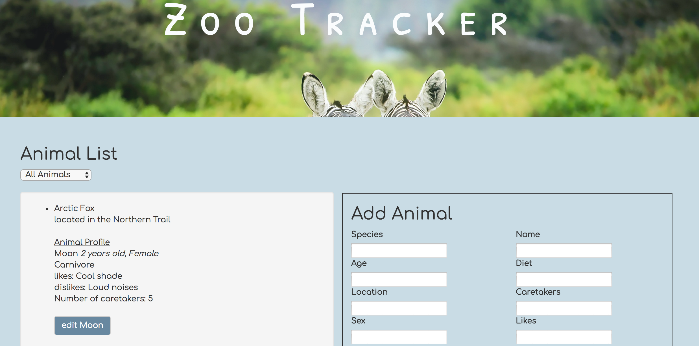
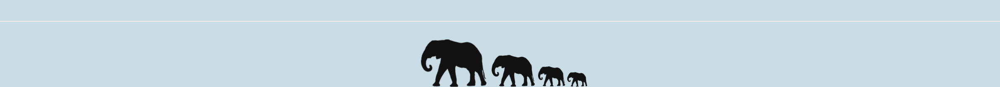

# zoo-tracker

This application was created for a hypothetical local zoo that is in need of a user friendly animal tracker. This application allows the user to view hard coded animal data, as well as enter more animals on the site. Animals can be edited and can be sorted to display by their age being older or younger than 2.

### Setup/Installation Requirements
* clone https://github.com/saschultz/zoo-tracker.git
* cd zoo-tracker
* run this series of commands:
  * `$ npm install`
  * `$ bower install`
  * `$ gulp build`
  * `$ gulp serve`

### User Stories
* I want to log a newly-admitted animal by submitting a form with animal species, name, age, diet, zoo location, number of needed caretakers, sex, one like and one dislike.
* I want to view a list of animals I have logged.
* I want options to view all animals, only young animals (less than 2 years of age), or only mature animals (more than 2 years of age).
* I want to click an animal to edit its name, age or caretakers.

### Known Bugs
No known bugs or issues here!

### Technologies Used
* JavaScript, TypeScript
* HTML, CSS, Sass
* Angular JS

### By Authors
Sara Schultz

### Support and contact details
For questions/support contact Sara: saschultz8@gmail.com

_contact info here_
### License
_MIT_ &copy; _2017_ **Sara Schultz**
